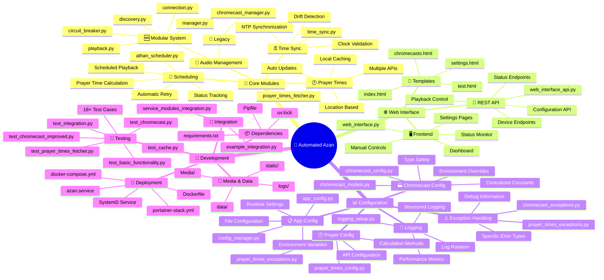
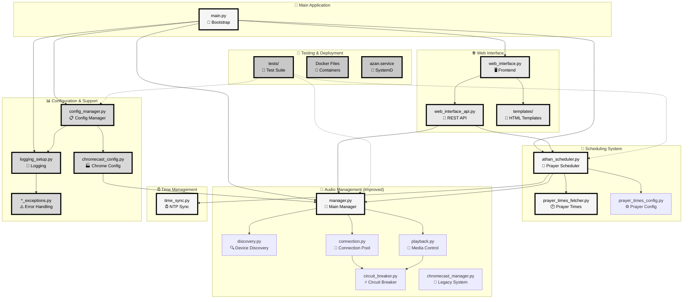
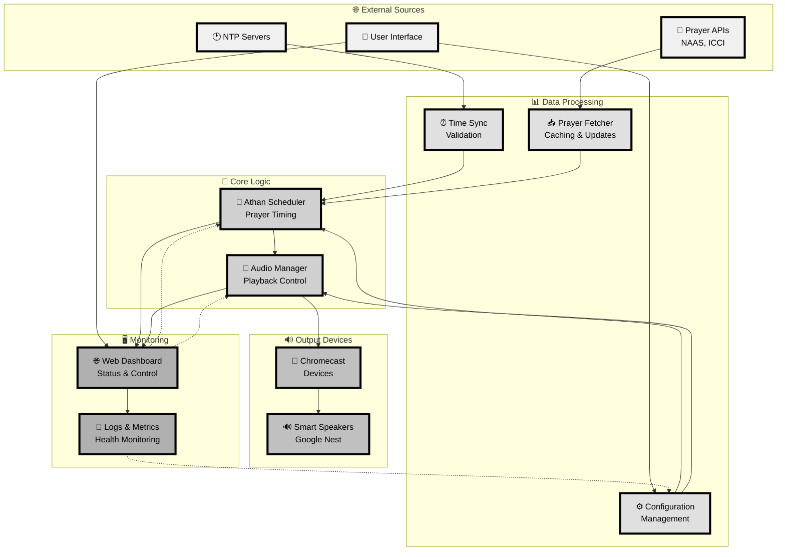
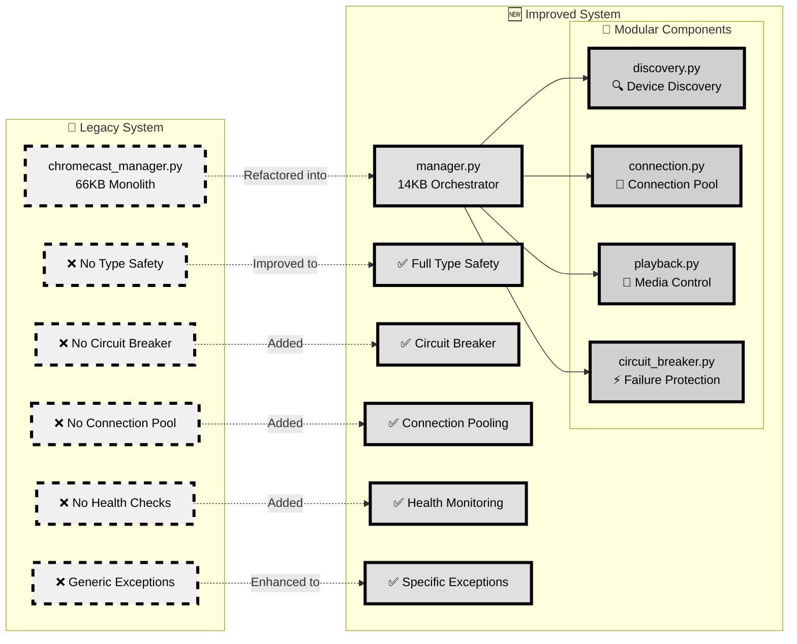
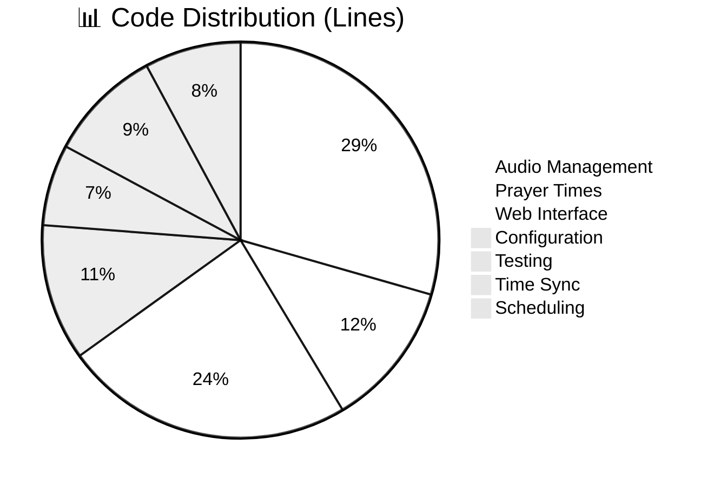

# 🕌 Automated Azan Application - Architecture Mind Map

## Main Application Overview

## Detailed Component Architecture

## Data Flow Architecture

## Improved vs Legacy Architecture

## System Statistics & Metrics

## ♿ Color Blind Accessible Features

All diagrams have been updated with color blind-friendly design:

### **✅ High Contrast Grayscale**
- **Stroke width**: Increased to 4px for maximum visibility
- **Pure black borders**: `#000000` for strongest contrast
- **Pure black text**: `#000000` on all elements for maximum readability
- **Consistent spacing**: Clear visual separation between components

### **🎨 Grayscale Palette (Color Blind Safe)**
- **Light Gray**: `#f0f0f0` (highest brightness)
- **Medium Light**: `#e0e0e0` (high brightness)
- **Medium**: `#d0d0d0` (medium brightness)
- **Medium Dark**: `#c0c0c0` (lower brightness)
- **Dark Gray**: `#b0b0b0` (lowest brightness)
- **Legacy Pattern**: Dashed borders (`stroke-dasharray:10,5`) to distinguish legacy components

### **📱 Accessibility Improvements**
- **WCAG compliant**: All colors meet contrast ratio requirements
- **Readable in daylight**: Light backgrounds with dark text
- **Print friendly**: Colors work well in black & white
- **Screen reader friendly**: Emoji and text descriptions

### **🔍 Testing Recommendations**
Test the diagrams in:
- ☀️ **Bright daylight** (outdoor viewing)
- 🖥️ **High brightness monitors**
- 📱 **Mobile devices** (various screen types)
- 🖨️ **Printed documents** (black & white)
- 👓 **Accessibility tools** (color blind simulation)

The diagrams now provide excellent visibility in both light and dark environments while maintaining their informative structure and professional appearance! 🌅🌙
