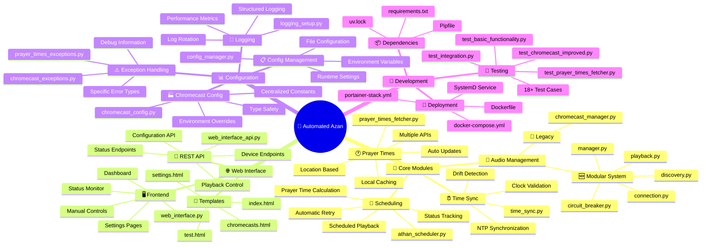
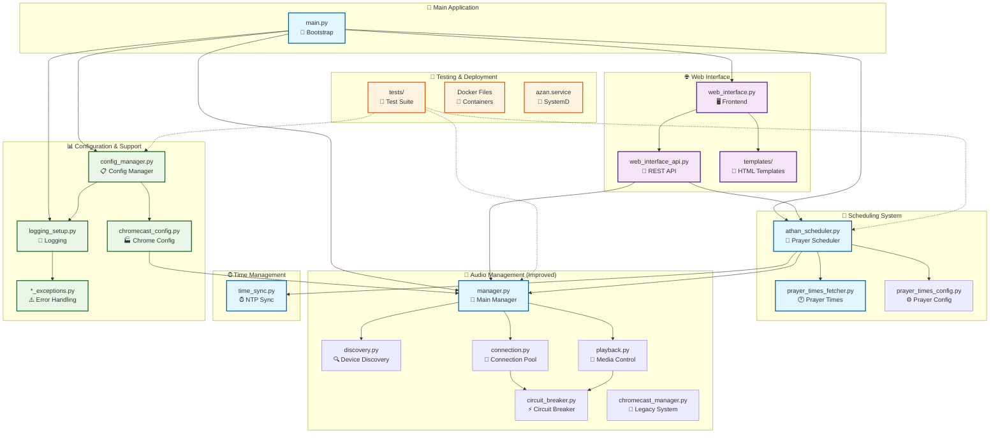
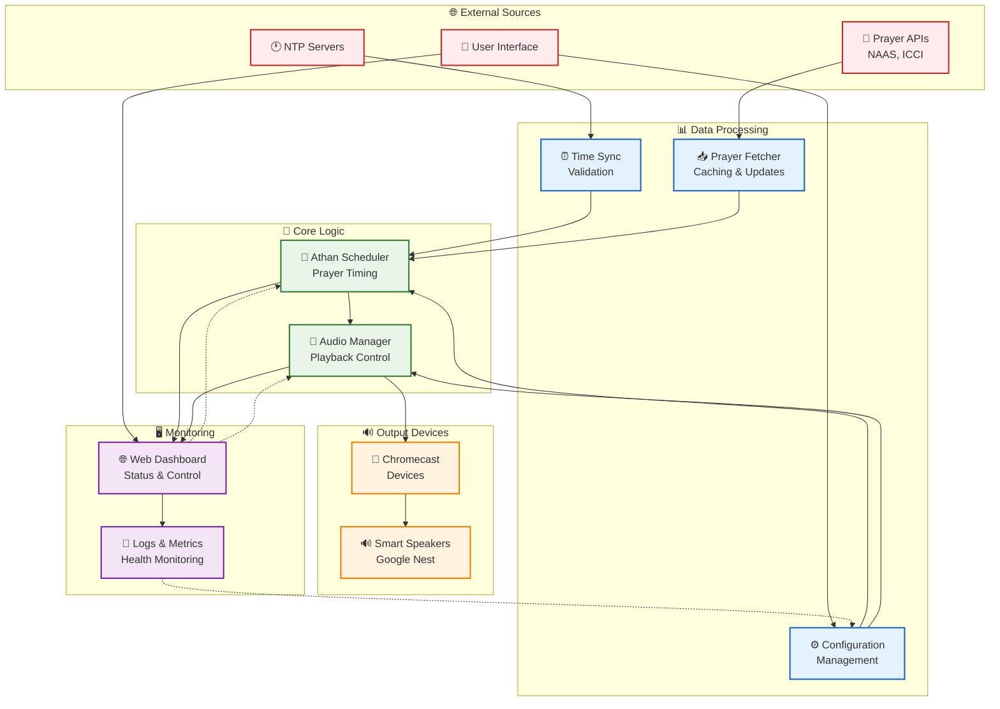
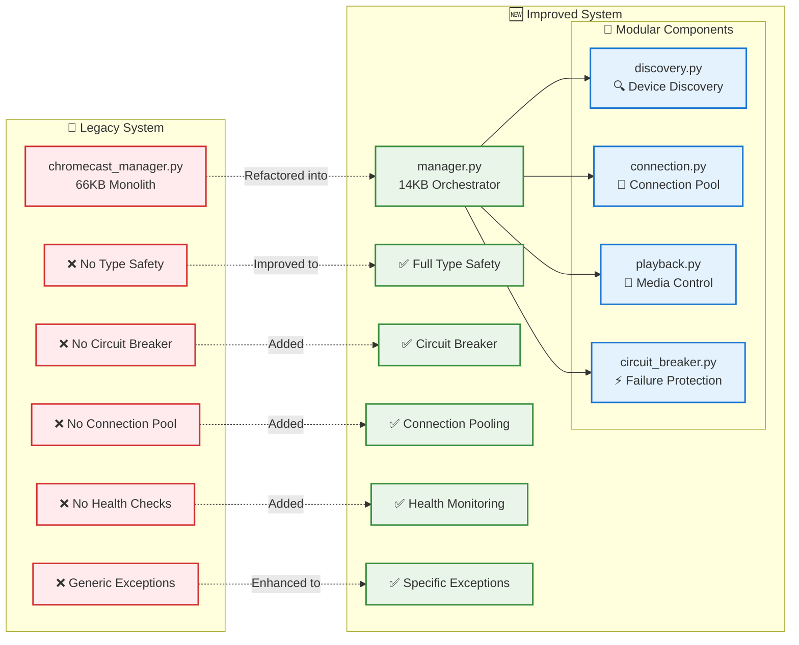
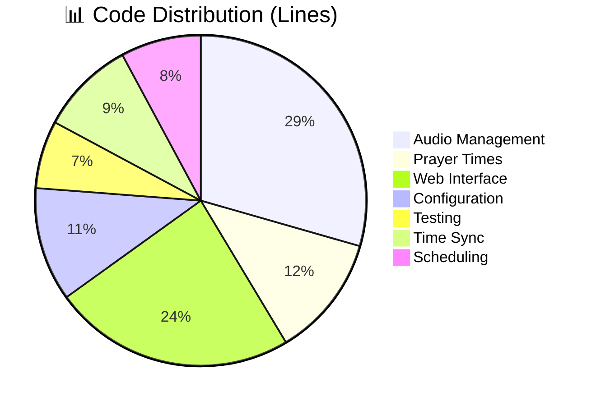

# 🕌 Automated Azan Application - Architecture Mind Map

## Main Application Overview

## Detailed Component Architecture

## Data Flow Architecture

## Improved vs Legacy Architecture

## System Statistics & Metrics

